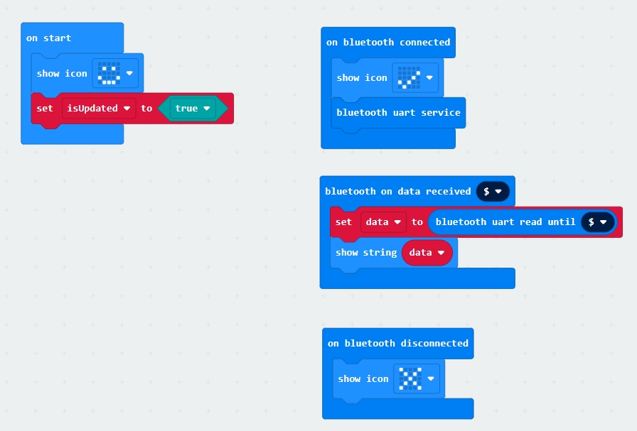

# microbit

## pins

https://makecode.microbit.org/device/pins

## Bluetooth Connection

* Pairing 

  https://makecode.microbit.org/v1/reference/bluetooth/bluetooth-pairing

* Reference

  https://sites.google.com/site/wenyumicrobit2/01-microbit%E7%A0%94%E7%A9%B6v2/20%E8%97%8D%E7%89%99%E5%86%8D%E6%8E%A2%E7%B4%A2

* Troubleshoot

   https://support.microbit.org/support/solutions/articles/19000069393

* Sample 

  

## WiFi/Internet Connection

 * References

  1. https://makecode.microbit.org/87621-52247-42264-55512
  2. https://makecode.microbit.org/pkg/cytrontechnologies/pxt-esp8266
  3. https://learn.littlebirdelectronics.com.au/raspberry-pi/wifi-module-with-micro-bit
  4. https://www.i-programmer.info/programming/148-hardware/9911-microbit-iot-in-c-getting-on-wifi.html#google_vignette

 * ESP8266 References
  1. https://makerpro.cc/2015/08/esp8266-selection-guideline/
  2. 

